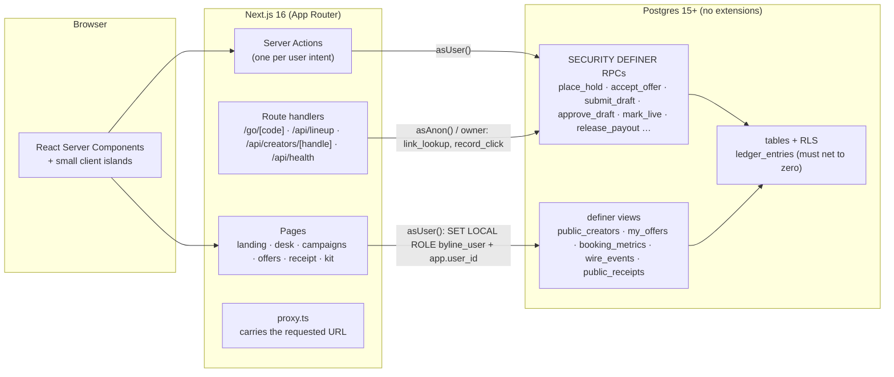
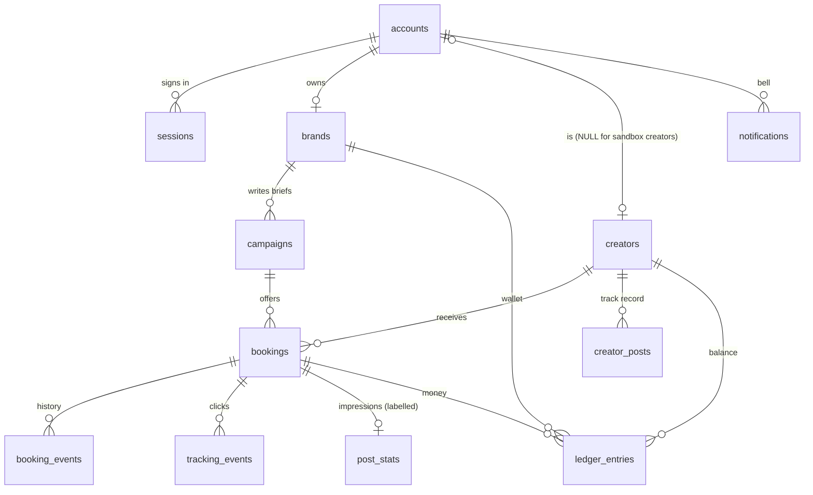
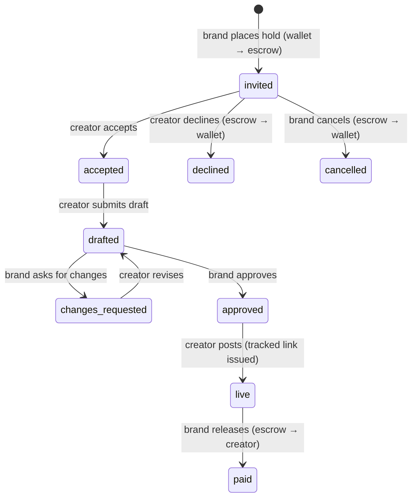

# Byline

**The wire desk for B2B creator campaigns.** Write one sentence about who you want to reach; get a ranked lineup of real creators with real prices and a projected result before you spend anything; hold the money in escrow; watch clicks arrive on the Wire; keep a public Receipt.

[](https://github.com/rahuljuluru92/nanoo_inspired/actions/workflows/ci.yml)

| | |
|---|---|
| **Live** | https://nanooinspired.vercel.app |
| **Walkthrough (≤ 5 min)** | WALKTHROUGH_URL |
| **Intro (1 min)** | INTRO_URL |
| **Try it without signing up** | open the live site → *Enter as the demo brand* / *Enter as the demo creator* (one click, no credentials). Or type them: `demo.brand@byline.test` / `demo.creator@byline.test`, password `byline-demo` (shared, fictional data, resettable). To be both roles at once, use a second browser or a private window. Real accounts: `/join` (any email, no verification) |

> Built for the 8x Engineering assignment: rebuild the *idea* behind a B2B LinkedIn-creator marketplace as an original product, with our own interface and a real backend (a working database and API, no mocked responses). Everything here was built with an AI coding agent; the whole conversation is in [`.agent-logs/`](.agent-logs), the plan and its live status in [`CLAUDE.md`](CLAUDE.md), and every decision, with what was rejected and why, in [`DECISIONS.md`](DECISIONS.md) (D-001 … D-099+).

---

## The idea in four nouns

**Brief → Lineup → Wire → Receipt.** Brands write a **Brief**, assemble a **Lineup**, watch the **Wire**, keep a **Receipt**. Creators get **Offers**, file a **Draft**, go **Live**, get **Paid**, and build a media kit out of verified Receipts. The same words are used in the interface, the routes and the code.

- **The brief is the search.** The brief is a sentence with editable slots (*"I'm launching **a SOC 2 automation tool** to **CTOs and Security leads** in **Fintech**, across **France and Germany**, with **€6,000**"*). Every edit re-ranks real creators from the database, live, on the landing page, **before sign-up**.
- **See the outcome before you commit.** The Tray shows what the selected creators should deliver (a *range* of clicks, cost per click) and that the wallet covers it. A "why this creator" chip explains every fit score.
- **Hold to commit.** Money moves into escrow with a press-and-hold (Enter, or a click under reduced motion, opens the same confirmation).
- **The Wire.** A live ticker of everything that happens, including real tracked-link clicks the moment they land.
- **The Receipt.** Every post ends in a public, printed-style proof: who, when, clicks (verified by our own redirect), what was paid, and **what it cannot vouch for** (impressions are labelled self-reported).

## Try the whole loop in three minutes

1. Open the live site. Type into the brief; watch the lineup change. **Enter as the demo brand.**
2. Add three creators → the Tray projects clicks and cost → **hold to place in escrow**.
3. In a second window (or on your phone) **Enter as the demo creator**: accept the offer, write a draft, submit.
4. Back as the brand: approve the draft. As the creator: paste any link and go live — you receive a tracked link.
5. Open the tracked link in a third tab (it redirects, and counts you once per day). The Wire ticks; the campaign board's click counter moves.
6. As the brand, **release the payout** → the creator's balance rises by exactly the price → open the public **Receipt**.

Seeded "sandbox" creators reply on their own (clearly labelled) so a lone reviewer can complete the loop; the demo creator is a real account you drive yourself. The demo password is public by design (fictional data; *Reset demo* is in the account menu).

## What's real

| Claim | How it's real |
|---|---|
| Two roles with real sign-in | scrypt password hashes, server-side sessions (only a SHA-256 of the token is stored), HttpOnly `SameSite=Lax` cookie, rate-limited sign-in that never reveals whether an email exists |
| Money | Integer cents, an **append-only double-entry ledger** whose every transaction must net to zero (a deferred constraint trigger, so the database itself refuses an unbalanced write), cached balances that are audited against the ledger in tests |
| Escrow | A hold moves cents wallet → escrow in one transaction; release/refund moves them on; escrow always equals the price of every open booking and zero for closed ones |
| State machine | `invited → accepted → drafted ⇄ changes_requested → approved → live → paid` (+ `declined`, `cancelled`), enforced in SQL functions, race-tested |
| Permissions | **Row-level security enforced per request**: each request runs `SET LOCAL ROLE byline_user` with the caller's id in a transaction setting, so the *database session* is restricted, not just our checks. Brands see their campaigns, creators their bookings, the public only kits and Receipts |
| Tracking | `/go/[code]` answers with a 302 first and records after the response; bots and link-preview fetchers are classified and not counted; the visitor is a hash of `ip + user-agent + UTC day + secret` (no raw IP is stored) |
| Public API | `GET /api/lineup`, `GET /api/creators/{handle}` — CORS-open, cached, throttled, JSON errors; the landing page's live desk *is* this API, and `/developers` is generated from the same code |
| Failure modes | Skeletons match the real layout; every error boundary retries; a database outage makes the tracked link answer a 503 with `Retry-After`, never a raw 500 |

### What is seeded, and what is not

Seeded on purpose, and labelled in the interface: the **39 sandbox creators** and their audience figures, the demo brands and their campaigns, the impressions and clicks on the demo Receipts (marked *simulated*), and the automatic replies of sandbox creators (a lone reviewer could not otherwise complete the loop). These are rows in the real database, not hardcoded responses: no screen or endpoint returns anything that was not read from Postgres, and no fixtures or mocks exist outside the `/styleguide` page. Everything else is created by whoever uses it: sign up as a creator at `/join` and you appear in every brand's desk lineup at once, and on the public API and sitemap within about 30 seconds (their cache); book yourself from a second account and the offer, the escrow, the tracked link, the clicks and the payout are all genuinely yours. The e2e suite does exactly that with two brand-new accounts.

## Architecture



- **All state changes and all money movement go through RPCs**; the server never writes a table directly on a user's behalf. `asOwner()` (unrestricted) exists only for sessions, account creation and click recording.
- **Portable Postgres.** One `DATABASE_URL`, no vendor services, no extensions: it runs on a laptop, in Docker, on Neon or on Supabase. (Auth is app-owned rather than a vendor's; decision D-051.)
- **The Wire is polling** (a few seconds while a page is open), not websockets: fewer moving parts, and it degrades to a static list (D-055).

### Data model



Money lives in `ledger_entries` (`account` ∈ `external · brand_wallet · escrow · creator_balance`, `kind` ∈ `topup · hold · release · refund`). `brands.wallet_cents` and `creators.balance_cents` are caches that the tests reconcile against it.

### Booking lifecycle



## Run it locally

Needs Node 20.9+ and any Postgres 15+.

```bash
cp .env.example .env.local        # set CLICK_HASH_SECRET to any long random string; DATABASE_URL below
npm ci
npm run db:start                  # macOS/Homebrew: a project-local Postgres on :54322 (touches nothing else)
npm run db:reset                  # migrate + seed 40 fictional creators, 3 brands, the demo world
npm run dev                       # http://localhost:3000
```

No Homebrew Postgres? `docker run -d -p 5432:5432 -e POSTGRES_HOST_AUTH_METHOD=trust postgres:16`, set `DATABASE_URL=postgres://postgres@localhost:5432/postgres`, then `npm run db:migrate && npm run db:seed`.

| Command | What it does |
|---|---|
| `npm run typecheck` · `lint` · `test` | strict TypeScript · ESLint · 57 unit tests (fit score, projection, money, tracking classification, …) |
| `npm run db:test` | 7 SQL suites in a throwaway database: ledger, state machine, RLS per role, tracking, sandbox creators, creator profile, Receipts |
| `npm run e2e` | 64 Playwright tests on a **production build** with a real database (see below). `npm run e2e:install` once |
| `npm run db:check` | is this database able to host Byline? (run first against a hosted URL) |
| `npm run db:reset-demo` | put the demo world back exactly as seeded (safe on a live database) |

Deploying: [`DEPLOY.md`](DEPLOY.md).

## How it's tested

- **Unit** (Vitest): pure logic.
- **Database** (`db/tests`, plain SQL, rolled back): the ledger nets to zero and cannot be edited; every transition and its money effect; RLS from each role's point of view (including that `PUBLIC` cannot execute functions created later, a bug the suite itself caught); tracking rules; sandbox timing.
- **End to end** (Playwright, production build, real Postgres, Chromium + iPhone-sized WebKit):
  - *Security & roles*: redirects and deep links, off-site `next` values, headers, API throttling, cross-account access, tracked-link edge cases.
  - *Responsive matrix*: 18 screens × 7 widths (320 → 1920): no sideways scroll, axe WCAG 2.2 AA clean, 44 px touch targets on touch widths, a silent console.
  - *Golden loop with two brand-new people* through the real interface (join → price → brief → fund → hold → accept → draft → changes → revise → approve → live → readers click → payout → public Receipt), then an audit of the whole ledger.
  - *Keyboard & reduced motion*, and *concurrency*: two Release clicks at once pay once; accept vs decline; two holds that together exceed the wallet; cross-role writes refused.
  - It runs on every push in [CI](.github/workflows/ci.yml), and against the live site with `E2E_BASE_URL` (cleaning up after itself).
- **Measured**: Lighthouse (mobile, simulated slow 4G) 91–96 performance, 100 accessibility / best practices / SEO (Receipts are `noindex` on purpose). Checked in real iOS Safari (simulator).

The e2e suite found, and we fixed, real defects that the unit and SQL tests could not: deep links lost at sign-in, Safari refusing a `Secure` cookie over `http://localhost`, the primary action below the fold in the phone tray, dialogs dropping focus to `<body>`, tablets getting desktop-sized controls, no skip link on public pages (D-092 … D-096).

## What was cut, and why

| Cut | Why |
|---|---|
| Real payments and payouts | Test-mode wallet; **the ledger and escrow are real**. Real money needs KYC and a payment provider, and adds nothing to the product claim (D-011) |
| LinkedIn API / scraping | Not permitted, brittle. Follower and impression figures are creator-reported (or seeded) and **labelled as such** everywhere; only clicks through our redirect are "verified" (D-040) |
| Managed service tier, human shortlist form, calculators, agency workspaces, blog | Not the core loop; replaced by the instant lineup (D-022) |
| Email delivery, chat | In-app notifications and a note on each booking instead |
| Admin panel, disputes, withdrawals | Seed data and SQL; out of scope for a first release |
| Websocket realtime | Polling is simpler and degrades gracefully (D-055) |
| AI brief parsing | Deterministic parsing first (D-015); an AI step needs a key and adds no reliability. Left as the first extension |
| Dark mode, PWA | Light "newsprint" theme only (D-023); a designed system beats a second one done halfway |
| Nonce-based CSP | Would force every page dynamic; the CSP allows inline scripts/styles (D-090) |
| Shared rate-limit store | Sign-in and API limits are in memory, per server instance (D-054). A shared store is the first production hardening step |

## How it differs from the product it was inspired by

The inspiration is the *idea*: a two-sided marketplace where brands book B2B creators for sponsored posts at a flat, creator-set price, with tracked links and fast payout. Nothing else is shared. No copy, names, statistics, imagery or layout were taken; all data is fictional; and the design was set against an explicit anti-list and squint-tested against it (design/BRIEF.md §2, §14).

| The obvious way | Byline |
|---|---|
| Browse a card grid or ask an AI bar | **The brief is the search**: a sentence with editable slots, a live ranked lineup |
| A human-built shortlist within two days | An **instant, real lineup before sign-up** on the landing page, from a public API |
| Photo cards | **Roster rows** with generated halftone portraits and a fit score that says *why* |
| A dashboard of stat tiles | A **Receipt** per post: public proof that states what it cannot vouch for |
| A notification list | **The Wire**, a live ticker of everything |
| A "confirm payment" button | **Hold to commit** money into escrow |
| Sky-blue glass and rounded black pills | **Newsprint × trading desk**: warm paper, ink, one vermilion, a serif display face with an italic turn, mono figures, no gradients or shadows |

## Design in one paragraph

Paper `#F5F1EA`, ink `#15130F`, vermilion `#FF4B1F` (fills only, ink text on it; small vermilion text is a darker `#C2300A` for contrast), highlighter yellow for emphasis, money green. Instrument Serif for display and numerals, Schibsted Grotesk for interface, JetBrains Mono for money and metrics. Hairline rules, mono datelines, masthead + Wire ticker instead of a sidebar. Motion is 150–200 ms and off under `prefers-reduced-motion`. The brand side is desktop-first with full phone parity (the Tray becomes a bottom sheet with its action pinned); the creator side is mobile-first. Full rules: [`design/BRIEF.md`](design/BRIEF.md); every component in every state is on the (unlisted, fictional-data) page `/styleguide`.

## Repository map

```
CLAUDE.md  DECISIONS.md  SPEC.md  PLAN.md  DEPLOY.md  SUBMISSION.md   plan + live status · every decision · behaviour · the original plan · how to deploy · hand-in kit
.agent-logs/  .claude/hooks/capture.py  CAPTURE-TEST.md              the agent conversation, captured automatically · how capture was verified
db/{migrations,seed,tests}                                           SQL is the source of truth: schema, RLS, RPCs, seed, tests
src/app/                                                             landing · (brand) desk, campaigns, wallet, wire · (creator) offers, deals, earnings, kit · receipt · c/[handle] · go/[code] · api/*
src/components/{ui,desk,campaign,creator,wire,receipt,shell,art}/    design system and screens' building blocks
src/lib/                                                             db (asUser/asAnon/asOwner), auth, fit + projection, tracking, money, …
e2e/                                                                 Playwright specs, helpers, live-site setup/teardown
scripts/                                                             db.mts (check · migrate · seed · reset-demo · cleanup-e2e · test), db-local.sh
```

## Working with the agent

`CLAUDE.md` is the single source of truth for plan and status and was updated at the end of every phase and slice; `DECISIONS.md` is append-only (a reversal is a new entry that says what it reverses); work was done in vertical slices, verified in a browser, committed per slice with the logs in the same history. Mistakes stay on the record, for example: default privileges did not revoke `EXECUTE` from `PUBLIC` as first assumed (found by a test, D-069); server-action files must export literal `async function`s, which neither `tsc` nor ESLint catches (D-075); a documentation fix was reported as done when it had not applied, and was caught and corrected on the next pass. Secrets never entered the conversation: prompts are logged verbatim, so credentials live only in `.env.local` and the host's environment.
